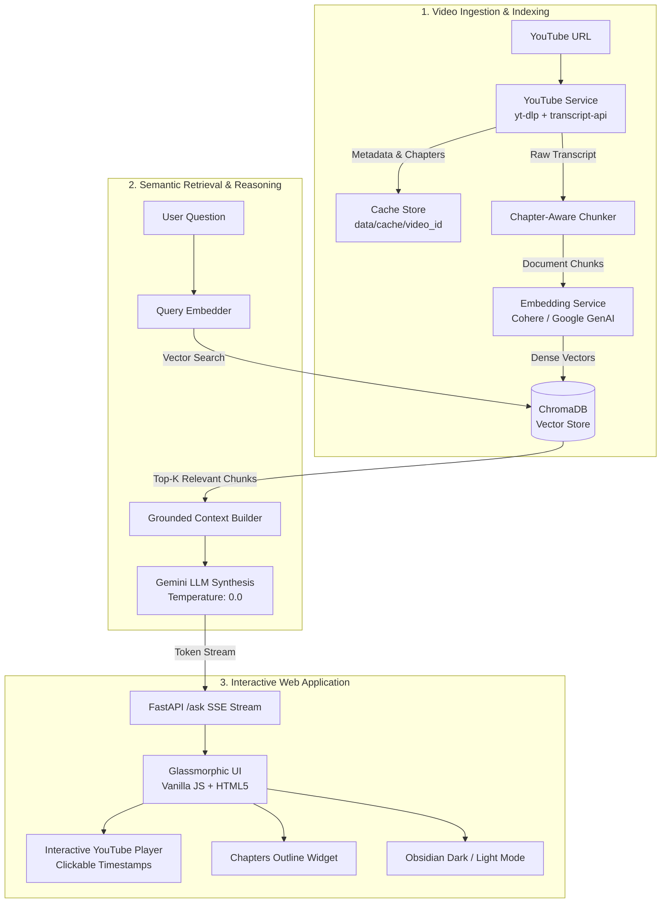

# 🎬 YouTube RAG Agent

<p align="center">
  
  
  
  
  
</p>

An enterprise-grade, real-time **Retrieval-Augmented Generation (RAG) assistant for YouTube videos**. Powered by **FastAPI**, **Google Gemini**, and **ChromaDB**, with a modern glassmorphic web interface featuring interactive chapter navigation, click-to-seek timestamp citations, and an Obsidian Dark/Light theme.

---

## ✨ Key Features

- **⚡ Sub-Second Transcript Ingestion**: Rapid transcript extraction with fallback metadata scraping (`youtube-transcript-api` + `yt-dlp`).
- **📖 Chapter-Aware Chunking**: Video metadata (title, channel, chapters) is parsed and prepended to each chunk for context-rich retrieval.
- **🎯 Strict Grounding & Zero Hallucinations**: Prompt-engineered with `temperature: 0.0` to answer strictly from the video content.
- **⏱️ Interactive Click-to-Seek Timestamps**: Citations like `[04:15]` are dynamically linked to the embedded YouTube player—click any timestamp to jump directly to that moment.
- **🗂️ Interactive Video Chapters & Outline**: Real-time chapter pills in the left column let users explore video topics and seek to specific sections.
- **🌗 Obsidian Dark & Crisp Light Theme**: Smooth on-click toggle with micro-animations and zero-flicker `localStorage` persistence.
- **💬 Modern Chat Composer**: Clean rounded capsule input with quick prompt chips (`✨ Summarize Video`, `💡 Key Takeaways`, `📋 Step-by-Step`, `💻 Code & Tools`) and auto-expanding textarea.
- **🚀 Real-Time Token Streaming**: Streams answers token-by-token using FastAPI's `StreamingResponse` for minimal time-to-first-token.
- **💾 Deterministic Multi-Layer Caching**: Transcripts, metadata, and embeddings are cached locally in `data/cache/{video_id}` so repeated queries load instantly.

---

## 🏗️ Architecture



---

## 📂 Project Structure

```
Youtube-RAG-main/
│
├── api.py                      # FastAPI server & static file mount
├── app/
│   ├── config.py               # Centralized settings & model configurations
│   ├── models.py               # Pydantic schemas (VideoMetadata, DocumentChunk)
│   ├── pipeline.py             # Orchestration pipeline (Process & Retrieval)
│   └── services/
│       ├── youtube_service.py      # yt-dlp metadata & chapters extraction
│       ├── transcript_service.py   # Fast YouTube transcript fetcher & fallback
│       ├── chunking_service.py     # Chapter-aware semantic chunking
│       ├── embedding_service.py    # Vector embeddings generator
│       ├── vector_store.py         # ChromaDB client & collection manager
│       └── rag_service.py          # Grounded Gemini streaming synthesis
│
├── data/
│   ├── cache/                  # Per-video local cache (metadata, transcripts)
│   └── chroma_db/              # Persistent ChromaDB vector database
│
├── public/                     # Modern Frontend
│   ├── index.html              # Responsive split-screen workspace
│   ├── css/
│   │   └── style.css           # Design tokens, Dark/Light mode, animations
│   └── js/
│       └── script.js           # Streaming chat, YouTube API, theme controller
│
├── .env.example                # Template for required environment variables
├── requirements.txt            # Python dependencies
└── README.md
```

---

## 🚀 Getting Started

### 1. Clone the Repository
```bash
git clone https://github.com/your-username/Youtube-RAG.git
cd Youtube-RAG
```

### 2. Set Up a Virtual Environment
```powershell
python -m venv .venv
# On Windows:
.\.venv\Scripts\Activate.ps1
# On Linux/macOS:
source .venv/bin/activate
```

### 3. Install Dependencies
```bash
pip install -r requirements.txt
```

### 4. Configure Environment Variables
Create a `.env` file in the root directory:
```env
# Google Gemini API Key (Required for LLM Synthesis)
GEMINI_API_KEY=your_gemini_api_key_here

# Cohere API Key (Required for default embeddings)
COHERE_API_KEY=your_cohere_api_key_here
```

---

## 🖥️ Running the Application

Start the FastAPI application:
```powershell
python api.py
```

The app will start at:
👉 **`http://127.0.0.1:8000`**

Open the URL in any modern browser. Enter any YouTube URL, click **Process**, and start asking in-depth questions!

---

## 🔌 API Endpoints

### `POST /process`
Ingests, chunks, embeds, and caches a YouTube video.
- **Request Body**:
  ```json
  {
    "url": "https://www.youtube.com/watch?v=VIDEO_ID"
  }
  ```
- **Response**:
  ```json
  {
    "video_id": "VIDEO_ID",
    "title": "Video Title",
    "channel": "Channel Name",
    "description": "Full Description...",
    "chapters": [
      { "title": "Introduction", "start_time": 0 }
    ],
    "total_chunks": 14
  }
  ```

### `POST /ask`
Streams a grounded response token-by-token.
- **Request Body**:
  ```json
  {
    "question": "What is explained in this video?",
    "video_id": "VIDEO_ID",
    "chat_history": []
  }
  ```
- **Response**: `StreamingResponse (text/plain)`

---

## 🎨 Design & Theme Customization

The user interface is built with **Vanilla CSS** utilizing design tokens:
- **Default Theme**: Crisp Light Theme
- **Dark Theme**: Deep Obsidian Theme (`#070a12`, `#0f182b`, `#142036`) with glowing electric blue accents
- **Micro-Animations**: Dynamic spin transitions on theme toggle, smooth button hover lifts, and glowing input states
- **No Heavy Frameworks**: Zero external CSS bloat—lightning fast 60fps performance.

---

## 🛡️ License

This project is licensed under the [MIT License](LICENSE).
