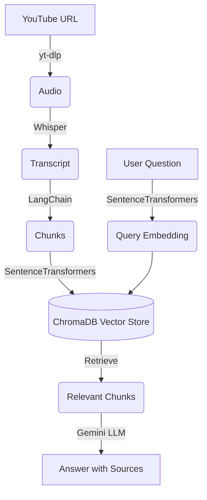

# YouTube RAG

A professional, end-to-end Retrieval-Augmented Generation (RAG) pipeline for YouTube videos, complete with a clean Streamlit User Interface.

## Overview

This project allows you to input any YouTube URL and ask questions about the video's content. The system uses AI to extract the transcript, chunk it, generate embeddings, and store them in a local vector database. When you ask a question, the assistant retrieves the most relevant chunks of the transcript to generate an accurate, grounded answer, complete with the sources it used.

## Architecture



### Folder Structure

```
Youtube-RAG-main/
│
├── app/
│   ├── __init__.py
│   ├── config.py             # Centralized configuration
│   ├── models.py             # Pydantic data models
│   ├── pipeline.py           # Main orchestration pipeline
│   │
│   ├── services/             # Modular service layers
│   │   ├── youtube_service.py     # yt-dlp downloading
│   │   ├── transcript_service.py  # Whisper transcription
│   │   ├── chunking_service.py    # Text splitting
│   │   ├── embedding_service.py   # Embedding generation
│   │   ├── vector_store.py        # ChromaDB integration
│   │   └── rag_service.py         # LLM synthesis
│   │
│   └── utils/
│       └── logging_utils.py  # Structured logging
│
├── data/
│   ├── cache/                # Deterministic caching by video ID
│   └── chroma_db/            # Persistent Vector DB
│
├── streamlit_app.py          # Main UI entry point
├── pyproject.toml            # Dependencies and config
└── README.md
```

## Installation

This project uses [`uv`](https://github.com/astral-sh/uv) for fast Python dependency management.

1. Install `uv` if you haven't already.
2. Sync the environment:
   ```bash
   uv sync
   ```

*Note: You must have `ffmpeg` installed on your system for Whisper to transcribe the audio.*

## Configuration

1. Create a `.env` file in the root directory.
2. Add your Gemini API key:
   ```env
   GEMINI_API_KEY=your_api_key_here
   ```

## Running the Application

To start the Streamlit UI, run:

```bash
uv run streamlit run streamlit_app.py
```

## Example Usage

1. **Enter a YouTube URL**: Try `https://youtu.be/GDm_uH6VxPY`.
2. **Process**: Wait for the pipeline to extract, transcribe, chunk, and embed the video. Intermediate files are cached deterministically by Video ID.
3. **Ask Questions**: E.g., "What are the main points discussed?"
4. **View Sources**: Click the "Retrieved Context" expander to see the exact transcript chunks the model used to generate its answer.

## Caching Strategy

To avoid redundant API calls and processing time, the pipeline deterministically caches:
- Downloaded audio
- Generated transcripts
- Transcript chunks
- Generated embeddings

These are stored in `data/cache/{video_id}/`. If you submit the same URL twice, the system instantly loads from the cache.

## Troubleshooting

- **Audio download fails**: Ensure `ffmpeg` is installed and added to your system PATH.
- **Empty transcript**: Check if the video has speech. Music-only videos will fail to transcribe meaningfully.
- **LLM Error**: Verify your `GEMINI_API_KEY` in the `.env` file and ensure you have not hit rate limits.
